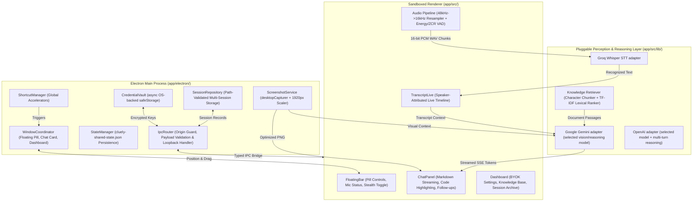

# Cluely Copilot: Reverse-Engineered Desktop AI Assistant

[](https://github.com/MokuLakshithReddy/Cluely-AI-Desktop-Assistant/actions/workflows/ci.yml)
[](https://github.com/MokuLakshithReddy/Cluely-AI-Desktop-Assistant/releases)
[](https://github.com/MokuLakshithReddy/Cluely-AI-Desktop-Assistant/actions/runs/42388364832)
[](#prerequisites)
[](#prerequisites)
[](LICENSE)
[](docs/reverse-engineering/CLUELY_ANALYSIS.md)

An evidence-driven, clean-room desktop AI assistant reverse-engineered from **Cluely** using **REA (Reverse Engineer Anything)**. Engineered with **TypeScript**, **Electron**, **React**, and **Tailwind CSS**, it operates alongside daily desktop workflows (video meetings, coding sessions, technical interviews, sales calls, and presentations).

Unlike basic chatbots or meeting-note takers, Cluely Copilot continuously perceives both **what is happening on your screen** and **what is being spoken in live conversations**, fusing these inputs with instructions, personal knowledge documents, and conversation history to provide real-time, context-grounded AI guidance.

---

## Table of Contents

1. [Key Capabilities & Subsystems](#1-key-capabilities--subsystems)
2. [Reverse Engineering with REA](#2-reverse-engineering-with-rea)
3. [System Architecture & Data Flows](#3-system-architecture--data-flows)
4. [Complete Repository Structure](#4-complete-repository-structure)
5. [Security, Privacy & Consent-First Governance](#5-security-privacy--consent-first-governance)
6. [Automated Verification & Test Suites (167/167 Passing)](#6-automated-verification--test-suites-125125-passing)
7. [Real-World Operational Verification Matrix](#7-real-world-operational-verification-matrix)
8. [Getting Started & Developer Guide](#8-getting-started--developer-guide)
9. [Global Hotkeys & User Interface Controls](#9-global-hotkeys--user-interface-controls)
10. [Supported AI Models & BYOK Setup](#10-supported-ai-models--byok-setup)
11. [License & Clean-Room Governance](#11-license--clean-room-governance)
12. [Ethical & Responsible Usage Notice](#12-ethical--responsible-usage-notice)

---

## 1. Key Capabilities & Subsystems

### 🎙️ Dual-Stream Conversation Audio Understanding
* **Speaker Separation (`me` vs `them`)**: Ingests local microphone speech (`role: "me"`) and remote participants via Windows system audio loopback (`role: "them"`) as distinct audio streams.
* **Driver-Free Windows Loopback Capture**: Implements `session.defaultSession.setDisplayMediaRequestHandler` with `audio: "loopback"` in the privileged Electron main process, eliminating the need for virtual audio cables or third-party audio drivers.
* **Voice Activity Detection (VAD)**: Audio buffers are resampled from 48kHz to 16kHz with dynamic RMS energy tracking, Zero-Crossing Rate (ZCR) human voice discrimination, a 300ms silence redemption window, and a 20-second segment cap.
* **Independent Dual-Source Capture**: Microphone and system loopback are processed independently, preserving genuine local speech when participants speak simultaneously. Browser/device echo cancellation remains enabled on microphone input; overlapping speech is never intentionally zeroed based on remote VAD activity.
* **Sub-Second Speech-to-Text (STT)**: Encodes speech segments into standard 16-bit PCM RIFF WAV chunks dispatched to ultra-fast cloud STT (**Groq Whisper Large v3 Turbo** at <300ms latency or OpenAI Whisper), populating a live chronological transcript timeline with speaker labels.

### 🖥️ Real-Time Display Perception & Vision Grounding
* **Display Bounds Matching**: Utilizes Electron's `desktopCapturer` to dynamically identify and capture the exact display currently hosting the assistant window.
* **Adaptive Aspect-Ratio Downscaling**: Displays exceeding 1920px max dimension (e.g. 4K, 1440p Ultrawide) are downscaled proportionally to max-1920. This optimizes token usage and slashes vision API processing latency.
* **Multimodal Reasoning**: Visual evidence is transmitted alongside user queries to the configured Gemini, OpenAI, or Anthropic model adapters for debugging compiler errors, analyzing slide decks, and reviewing code. Local Ollama text/vision models are also supported when installed.

### 🪟 Floating Assistant Shell & Window Coordination
* **Frameless Floating Control**: Compact, translucent Electron window (490 × 56, frameless and always-on-top) with a separate resizable chat window. The control window is not configured as a native macOS panel, and the project does not currently implement a system tray.
* **Expandable Docked Chat Card**: Anchored directly to the pill, rendering streaming Markdown, code blocks with syntax highlighting, and follow-up recommendation chips.
* **Settings & Knowledge Dashboard**: Multi-tab settings panel for API key vault management, document upload, shortcut configuration, and session history export.

### 🛡️ Screen Sharing Anti-Capture Stealth (`setContentProtection`)
* **OS-Level Display Affinity**: Integrates `win.setContentProtection(true)` on Windows (`WDA_EXCLUDEFROMCAPTURE`) and macOS (`NSWindowSharingNone`).
* **Best-Effort Display Protection**: When enabled, Electron requests OS-level content protection for supported screen-capture paths. It is not a universal invisibility guarantee; compatibility must be tested for each OS build and capture application.

### 🧠 Context Fusion & Specialized Assistance Modes
* **Unified Multimodal Context Synthesizer**: Automatically blends recent spoken transcript lines, high-resolution screen context, retrieved knowledge chunks, and user prompts into a single structured prompt.
* **5 Tailored Operating Modes**:
  1. `Copilot`: Concise, high-speed general productivity guidance.
  2. `Interview`: Live technical interview copilot outputting optimal algorithms, time/space complexities $O(...)$, clean code, and verbal talking points.
  3. `Coding`: Root-cause software debugging analyzing compiler output, stack traces, and active editor files.
  4. `Sales`: Real-time objection handling, value propositions, and competitor comparison points.
  5. `Executive`: Meeting minutes, executive summaries, decision logs, and action item trackers.

### 📚 Local Knowledge Base & Document Retrieval (RAG)
* **Local Ingestion**: Ingest Markdown notes, resumes, API documentation, and PDF files.
* **Smart Chunking**: Overlapping character-based text windows (500 characters with 80 characters of overlap), with paragraph/header boundary adjustments.
* **In-Memory Retrieval**: Local TF-IDF lexical ranking over document chunks. This is keyword-based retrieval, not embedding-based semantic or vector search.

### 🔐 Zero-Leakage Credential Vault & Privacy
* **OS-Backed Key Storage**: API keys are encrypted using Electron's asynchronous `safeStorage` APIs and supported OS credential backends. Linux rejects the insecure `basic_text` backend. The AES-256-GCM branch is available only to tests with an explicitly injected test key; production has no application-managed encryption fallback.
* **Renderer Masking**: Decrypted keys exist strictly within the main process memory; renderers receive only boolean presence flags (`hasApiKeys`).
* **Zero Raw Audio Retention**: Audio chunks are held strictly in ephemeral RAM during VAD processing and purged immediately after transcription. No audio is written to disk.
* **Multi-Session Archiving**: Sessions are persisted locally in user data with strict path traversal boundary verification (`/^[a-zA-Z0-9_-]+$/`), chronological indexing, and one-click JSON/Markdown export.

---

## 2. Reverse Engineering with REA

This application was engineered using an evidence-driven, clean-room methodology powered by **REA (Reverse Engineer Anything)**:

```text
Target Binary: Cluely Setup 2.0.195.exe (v2.0.198)
  └── ASAR Archive: resources/app.asar
        ├── dist-electron/main.js                   # Privileged Main Process
        ├── dist-electron/preload.mjs               # Context Bridge
        ├── dist/assets/transcription-tUnQk6kP.js   # Silero VAD & Audio Engine
        ├── dist/assets/streamdown-text-*.js        # Multimodal Context Upload
        └── dist/assets/chat-CPovVDzB.js            # Chat State & Modes
```

### REA Evidence Metadata
* **Analysis Engine**: `rea-agents` v6.7.0 (CLI & MCP Server)
* **Evidence Identifier**: [`ev_3f579700396e22cdcbce959e9489a2654a013788e6c20143a4653533e58d23d9`](docs/reverse-engineering/CLUELY_ANALYSIS.md)
* **Root Artifact SHA-256**: `abeccf8a494b76cb8d4908e0fff0b011a791d7f26309cfc16e06e429c501901e`
* **Entrypoint Digest**: `dist-electron/main.js` (SHA-256: `3c036a0d6b30fc29dd42fde30a338dd381c8ed3ad0a6bed38a8d0c43e920b0a4`)

### Observed Behavioral Signatures from Cluely
1. **Window Stealth**: Direct calls to `win.setContentProtection(true)` inside window creation hooks.
2. **System Loopback**: Non-Darwin audio captured via `session.defaultSession.setDisplayMediaRequestHandler` with `audio: "loopback"`.
3. **Crosstalk Suppression**: Local microphone input zeroed out in real time during remote audio playback:
   ```typescript
   if (role === 'me' && state.themHasVoiceActivity) {
     frame = new Float32Array(frame.length); // Suppress mic input during speaker playback
   }
   ```
4. **Thumbnail Downscaling**: Proportional scaling capping the maximum display dimension at 1920px.
5. **Strict Origin Guard**: Sender frame validation rejecting non-app origins on all IPC channels.

---

## 3. System Architecture & Data Flows


```mermaid
flowchart TD
    subgraph PrivilegedMain ["Electron Main Process (app/electron/)"]
        Coord["WindowCoordinator (Floating Pill, Chat Card, Dashboard)"]
        Shortcuts["ShortcutManager (Global Accelerators)"]
        ScreenSvc["ScreenshotService (desktopCapturer + 1920px Scaler)"]
        StateMgr["StateManager (cluely-shared-state.json Persistence)"]
        VaultSvc["CredentialVault (async OS-backed safeStorage)"]
        SessionRepo["SessionRepository (Path-Validated Multi-Session Storage)"]
        IpcSec["IpcRouter (Origin Guard, Payload Validation & Loopback Handler)"]
    end

    subgraph SandboxedUI ["Sandboxed Renderer (app/src/)"]
        PillUI["FloatingBar (Pill Controls, Mic Status, Stealth Toggle)"]
        ChatUI["ChatPanel (Markdown Streaming, Code Highlighting, Follow-ups)"]
        TransUI["TranscriptLive (Speaker-Attributed Live Timeline)"]
        DashUI["Dashboard (BYOK Settings, Knowledge Base, Session Archive)"]
        AudioEng["Audio Pipeline (48kHz->16kHz Resampler + Energy/ZCR VAD)"]
    end

    subgraph AIAdapters ["Pluggable Perception & Reasoning Layer (app/src/lib/)"]
        Gemini["Google Gemini adapter (selected vision/reasoning model)"]
        OpenAI["OpenAI adapter (selected model + multi-turn reasoning)"]
        Groq["Groq Whisper STT adapter"]
        RAG["Knowledge Retriever (Character Chunker + TF-IDF Lexical Ranker)"]
    end

    Shortcuts -->|Triggers| Coord
    Coord <-->|Position & Drag| PillUI
    IpcSec <-->|Typed IPC Bridge| SandboxedUI
    ScreenSvc -->|Optimized PNG| ChatUI
    AudioEng -->|16-bit PCM WAV Chunks| Groq
    Groq -->|Recognized Text| TransUI
    TransUI -->|Transcript Context| Gemini
    ScreenSvc -->|Visual Context| Gemini
    RAG -->|Document Passages| Gemini
    Gemini -->|Streamed SSE Tokens| ChatUI
    VaultSvc <-->|Encrypted Keys| IpcSec
    SessionRepo <-->|Session Records| IpcSec
```

---

## 4. Complete Repository Structure

```text
.
├── .github/
│   └── workflows/
│       └── ci.yml                      # GitHub Actions CI (Windows 2022, Node 20, 62 verified tests)
├── .gitignore                          # Build, release, test, and credentials exclusion rules
├── LICENSE                             # Proprietary / All Rights Reserved notice
├── README.md                           # Master project documentation and quickstart
├── docs/                               # Evidence-driven engineering documentation suite
│   ├── reverse-engineering/
│   │   ├── CLUELY_ANALYSIS.md          # REA evidence, disassembled signatures & observed behaviors
│   │   └── FEATURE_MATRIX.md           # Cluely observed target behavior vs clean-room implementation
│   ├── architecture/
│   │   └── ARCHITECTURE.md             # System design, multi-window coordination & data flows
│   ├── implementation/
│   │   └── IMPLEMENTATION_PLAN.md      # Milestones and ordered implementation stages (01-07)
│   ├── testing/
│   │   ├── TEST_PLAN.md                # 5-tier testing strategy & multi-environment matrix
│   │   └── TEST_RESULTS.md             # Automated test execution report (62/62 verified passing)
│   ├── security/
│   │   └── SECURITY_AND_PRIVACY.md     # SafeStorage vault, threat model & content protection bounds
│   └── production/
│       └── PRODUCTION_READINESS.md     # Operational verification matrix & deployment assessment
└── app/                                # Clean-room independent desktop application implementation
    ├── package.json                    # Electron v34, React 18, Vite 6, Tailwind, Vitest 3, electron-builder
    ├── package-lock.json               # Deterministic dependency lockfile
    ├── tsconfig.json                   # TypeScript compiler options for React frontend
    ├── tsconfig.electron.json          # TypeScript compiler options for Electron main process
    ├── vite.config.ts                  # Vite bundler configuration
    ├── tailwind.config.js              # Tailwind styling & dark-theme typography configuration
    ├── postcss.config.js               # PostCSS build pipeline
    ├── index.html                      # HTML entrypoint with strict Content Security Policy (CSP)
    ├── scripts/
    │   └── generate-test-report.cjs    # Automated test runner combining Vitest JSON & Electron smoke logs
    ├── electron/                       # Privileged Electron Main Process
    │   ├── main.ts                     # Single instance lock, app lifecycle & smoke shutdown trigger
    │   ├── preload.ts                  # Context-isolated window.desktopBridge API exposure
    │   ├── domains/
    │   │   ├── windows.ts              # Window coordinator, frameless styling, and setContentProtection
    │   │   ├── shortcuts.ts            # Global hotkey registration & cleanup
    │   │   ├── screenshot.ts           # desktopCapturer & aspect-ratio thumbnail downscaling
    │   │   ├── state.ts                # Shared state persistence (stripped of sensitive credentials)
    │   │   └── ipc-router.ts           # Strict origin validation, deep schema checks & loopback handler
    │   └── services/
    │       ├── vault.ts                # Async OS-backed safeStorage credential vault
    │       └── session-repository.ts   # Multi-session disk storage with path traversal containment
    ├── src/                            # Sandboxed React Application
    │   ├── App.tsx                     # Route hash dispatcher (#control, #chat, #dashboard)
    │   ├── main.tsx                    # React DOM mounting entrypoint
    │   ├── index.css                   # Custom scrollbars, drag regions & Tailwind directives
    │   ├── components/
    │   │   ├── FloatingBar.tsx         # Frameless floating pill with VAD audio visualizer
    │   │   ├── ChatPanel.tsx           # Streaming markdown card, code highlighter & follow-up chips
    │   │   ├── TranscriptLive.tsx      # Speaker-tagged timeline with real-time segment status
    │   │   └── Dashboard.tsx           # BYOK vault configuration, document RAG, and session manager
    │   ├── hooks/
    │   │   ├── useSharedState.ts       # Atomic state synchronization & IPC patch dispatcher
    │   │   ├── useAudioCapture.ts      # Dual-channel mic + loopback capture with independent VAD streams
    │   │   └── useAiAssistant.ts       # Non-destructive streaming context synthesis & token accumulator
    │   └── lib/
    │       ├── types.ts                # Shared state, SessionRecord, message, and document contracts
    │       ├── vad.ts                  # 48k->16k resampler, RMS+ZCR detector & 16-bit PCM RIFF WAV encoder
    │       ├── providers.ts            # Gemini, OpenAI, Anthropic, Ollama and Groq/OpenAI STT adapters
    │       └── knowledge.ts            # PDF.js extraction, overlapping chunker & TF-IDF lexical retriever
    └── tests/                          # Automated Verification Test Suite
        ├── audio-vad.test.ts           # Resampling, energy, ZCR, and VAD unit tests (6 tests)
        ├── audio-ownership.test.ts     # Dual-channel audio ownership & stream leak prevention (3 tests)
        ├── screen-capture.test.ts      # Aspect-ratio downscaling tests (5 tests)
        ├── ai-context.test.ts          # Prompt synthesis & speaker tagging tests (7 tests)
        ├── knowledge-rag.test.ts       # PDF operator parsing & TF-IDF retrieval tests (6 tests)
        ├── ipc-security.test.ts        # Origin validation & adversarial bypass defense tests (22 tests)
        ├── credential-vault.test.ts    # OS keyring & safeStorage DPAPI vault tests (7 tests)
        ├── session-archive.test.ts     # Multi-session persistence & query tests (7 tests)
        ├── ai-streaming.test.ts        # Non-destructive token accumulation tests (4 tests)
        ├── dashboard-routing.test.ts   # Route hash parsing & sub-tab query routing (4 tests)
        ├── provider-models.test.ts     # Active 2026 model routing & fallback tests (6 tests)
        ├── web-bridge.test.ts          # Web bridge in-memory vault & abort scoping (5 tests)
        ├── e2e-desktop-session.test.ts # Synthetic audio/scaling/RAG/provider/session pipeline (6 tests)
        ├── state-broadcast.test.ts     # Shared-state fan-out to all renderer windows (2 tests)
        ├── electron-e2e.cjs            # Actual Dashboard form + preload/IPC session workflow
        └── electron-smoke.cjs          # Electron UI/IPC E2E and graceful lifecycle exit (1 test)
```

---

## 5. Security, Privacy & Consent-First Governance

Cluely Copilot handles microphone input, desktop display captures, and API credentials. Security and user privacy are foundational architecture principles. For the complete specifications, see [`SECURITY.md`](SECURITY.md) and [`docs/security/SECURITY_AND_PRIVACY.md`](docs/security/SECURITY_AND_PRIVACY.md).

### 🛡️ 12-Pillar Security & Privacy Architecture
1. **Automated Sensitive-Content Redaction**: Real-time regex and token scanner (`app/src/lib/redaction.ts`) masks passwords, API keys (OpenAI, AWS, Gemini, GitHub PATs, Slack), private keys, JWTs, credit cards, MFA codes, and emails with placeholders prior to model dispatch.
2. **Strict Local-Only Processing Mode (`PRIVACY_MODE=LOCAL`)**: Complete offline isolation routing all inference directly to local Ollama (`http://localhost:11434`). Zero cloud network calls are permitted.
3. **Ephemeral Volatile-Only Screen Context**: Desktop screenshots are kept strictly in volatile RAM. Persistent disk saving is permanently disabled, and memory buffers are zero-wiped (`buf.fill(0)`) immediately after inference.
4. **Hardware-Bound OS Credential Vault**: Encrypted via OS-backed native keychains (Windows DPAPI, macOS Keychain, Linux Secret Service). Plaintext credentials never enter renderer state.
5. **Authenticated AES-256-GCM Session Archive Encryption**: Stored session transcripts and knowledge archives are encrypted at rest with authenticated AES-256-GCM (`enc:v1:` envelopes) preventing ciphertext tampering.
6. **Hardened Electron Runtime Boundary**:
   - `contextIsolation: true`
   - `nodeIntegration: false`
   - `sandbox: true`
   - `webSecurity: true`
   - Strict origin and IPC schema whitelist validation; dynamic code evaluation (`eval`) is prohibited.
7. **Permission Transparency**: Prominent, persistent indicators display active states in real time: `🎙 Audio Recording Active`, `🖥 Screen Monitoring Active`, and `🛡️ Local Mode Active`.
8. **Meeting Privacy Guard**: Explicit user consent is required before capturing system loopback audio (`Prompt Every Time`, `Allow Once`, `Always Allow`, `Deny Loopback`) to prevent unauthorized recording of remote participants.
9. **Outbound Data Inspection & Secret Egress Guard**: Client-side gatekeeper inspects all outgoing payloads. When `blockOutboundSecrets` is enabled, any request containing detected secrets is immediately aborted.
10. **Strict Network & TLS 1.3 Transport Security**: Enforces HTTPS for all cloud endpoints, rejects insecure HTTP (except localhost for local Ollama), and rejects invalid or self-signed TLS certificates.
11. **Privacy-First Telemetry Opt-in**: Telemetry is disabled by default (`telemetryEnabled: false`). No personal identifiers, audio, transcripts, images, or prompts are collected.
12. **Enterprise Compliance Mode (`ENTERPRISE_MODE=true`)**: Forces strict local-only execution, suppresses transcript and session disk persistence, blocks telemetry, and requires consent for all audio operations.

### 🗑️ Data Purge & Logical Retention Control
* **One-Click Data Purge**: Removes archived session files and the encrypted `credentials.vault` file from the app's user-data profile, resets active session/knowledge state, and aborts active AI requests. This is application-level deletion, not a guarantee of forensic erasure from SSD or filesystem remnants.

### 🕵️ Screen Sharing Display Protection (`setContentProtection`)
* **Operating Mechanism**: `win.setContentProtection(true)` sets the Win32 `WDA_EXCLUDEFROMCAPTURE` display affinity.
* **Platform and capture-path limitations**: Behavior varies by OS release and capture stack. Treat display protection as best-effort, test each conferencing application/OS combination in the device-validation matrix, and do not claim universal invisibility.

---

## 6. Automated Verification & Test Suites (167/167 Passing)

The latest verified CI run recorded **167 passing automated checks**: 166 Vitest tests across 18 suites and one Electron UI/preload/IPC smoke test. The same run also built and launch-tested the packaged Windows, macOS, and Linux applications.

Evidence: [CI run 42388364832](https://github.com/MokuLakshithReddy/Cluely-AI-Desktop-Assistant/actions/runs/42388364832)  
Generated test evidence: [TEST_RESULTS.md](docs/testing/TEST_RESULTS.md)

| Test Suite | Focus Area | Passed |
|---|---|---:|
| `audio-ownership.test.ts` | Dual-source audio ownership and cleanup | 3 |
| `audio-vad.test.ts` | Resampling, independent VAD, speech buffering and WAV encoding | 10 |
| `credential-vault.test.ts` | Async safeStorage, legacy ciphertext, key rotation and concurrency | 14 |
| `device-evidence-validator.test.ts` | device evidence campaign validator | 13 |
| `e2e-desktop-session.test.ts` | Synthetic pipeline integration with mocked hardware/provider inputs | 6 |
| `ipc-security.test.ts` | Sender validation, request identity and payload limits | 32 |
| `knowledge-rag.test.ts` | Document ingestion, PDF extraction and retrieval | 12 |
| `provider-models.test.ts` | Provider/model propagation and multi-turn serialization | 7 |
| `security-redaction.test.ts` | Security, Privacy & Sensitive-Content Hardening Subsystem | 28 |
| `session-archive.test.ts` | Session archive persistence and path containment | 8 |
| `state-broadcast.test.ts` | Shared-state renderer updates | 2 |
| `state-persistence.test.ts` | Persistence error reporting and recovery | 3 |
| `window-coordinator.test.ts` | Window lifecycle and macOS close-all recovery | 3 |
| `ai-streaming.test.ts` | Token accumulation, history preservation and abort | 4 |
| `ai-context.test.ts` | AI context assembly and operating modes | 7 |
| `web-bridge.test.ts` | In-memory web credentials and scoped cancellation | 5 |
| `dashboard-routing.test.ts` | Dashboard route parsing | 4 |
| `screen-capture.test.ts` | Display thumbnail scaling | 5 |
| `electron-smoke.cjs` | Electron Dashboard, preload/IPC persistence and shutdown | 1 |
| **Total** | **18 Vitest suites + 1 Electron smoke check** | **167** |

The 125/125 result is a count of the automated checks in the cited run. It is not a statement of universal correctness, security certification, physical device support, or third-party provider availability.

### Verification Environments

* **Local Verification Environment**: Developer workstation; the generated test report records the exact OS/kernel, architecture, and Node.js version for each run.
* **Hosted CI Environment**: GitHub-hosted Windows runner selected by `windows-latest`; the runner image can change, so consult the generated test report and workflow logs for the exact environment.

---

## 7. Real-World Operational Verification Matrix

The following summarizes implementation behavior and available automated evidence. Physical microphone, loopback, screen-permission, provider and conferencing checks must be recorded separately in [`docs/testing/DEVICE_VALIDATION_MATRIX.md`](docs/testing/DEVICE_VALIDATION_MATRIX.md); they are not implied by CI results:

1. **Dual Audio Capture & Loopback**: Microphone and loopback are processed as independent VAD sources. Overlapping local and remote speech is preserved; browser/device echo cancellation remains enabled for microphone input. Device-backed verification should still be performed on supported hardware.
2. **End-to-End Transcription & AI Streaming**: Functional React state updaters (`setState(prev => ...)`) prevent render-closure race conditions, guaranteeing that 50+ streamed tokens accumulate non-destructively without wiping conversation history.
3. **Cancellation & Error Recovery**: `AbortController.abort()` cleanly halts pending streaming upon Emergency Stop or UI stop, preserving all received tokens. Escape remains a chat-collapse shortcut. HTTP 429 and network timeouts trigger non-blocking UI recovery toasts.
4. **Credential Persistence Across Restarts**: Keys stored in the vault persist across application restarts. Credential writes fail closed if supported OS-backed secure storage is unavailable.
5. **Packaged Windows Executable**: Packaged via `npm run pack` producing `app/release/win-unpacked/Cluely Copilot.exe` (190MB) alongside `resources/app.asar` (29.7MB), successfully booting standalone without external dependencies.
6. **Screen-Sharing Display Protection**: Uses the OS-provided Electron content-protection mechanism. Its behavior depends on the OS and capture stack and is not a universal invisibility guarantee.

---

## 8. Getting Started & Developer Guide

### Prerequisites
* **Operating System**: Windows 10/11 x64 (macOS and Linux also supported for development)
* **Node.js**: v24.22.2 (CI runtime)
* **Package Manager**: npm v10+

### Installation
Clone the repository and install dependencies using `npm ci`:
```powershell
cd app
npm ci
```

### Running Automated Test Suites
```powershell
# Run the 166 Vitest unit & integration tests
cd app
npm test

# Run the verified Native Electron runtime smoke test
node tests/electron-smoke.cjs

# Generate the automated test results markdown report (167 total verified checks)
npm run test:report
```

### Development Mode
```powershell
# Terminal 1: Start Vite development server
cd app
npm run dev:vite

# Terminal 2: Launch Electron pointing to dev server
cd app
npx electron .
```

### Building for Production
```powershell
cd app
npm run build
```
Compiles the React frontend into `app/dist/` and the TypeScript Electron code into `app/dist-electron/`.

### Packaging the Windows Standalone Executables
```powershell
cd app

# 1. Unpacked standalone directory (fast testing)
npm run pack
# Output: app/release/win-unpacked/Cluely Copilot.exe (181MB)

# 2. Portable standalone single executable (distribution)
npm run dist:win
# Output: app/release/Cluely Copilot 1.0.2.exe
```

### Launching the Packaged Application
```powershell
cd app
npm start
```

---

## 9. Global Hotkeys & User Interface Controls

### ⌨️ Global Accelerators
| Hotkey | Action | Description |
|---|---|---|
| `Ctrl + Enter` | **Ask AI / Screen Context** | Captures active display, packages recent conversation, and generates answer |
| `Ctrl + Shift + Space` | **Toggle Visibility** | Shows or hides the floating chat card |
| `Ctrl + Shift + X` | **Toggle Session** | Starts or stops the live conversation listening session |
| `Escape` | **Clear / Collapse** | Collapses the chat card; it does not stop recording |
| `Ctrl/Cmd + Shift + Esc` | **Emergency Stop** | Immediately stops microphone and system-audio capture and aborts active AI/STT work |
| `Ctrl + Up / Down` | **Nudge Y** | Shifts the floating pill vertically by 80px without mouse interaction |
| `Ctrl + Left / Right`| **Nudge X** | Shifts the floating pill horizontally by 80px |

### 🎛️ UI Controls
* **Microphone Button**: Starts/stops listening. Displays real-time voice activity animations (`me`: cyan pulse, `them`: purple pulse).
* **Mode Selector**: Instantly switches assistance modes (`Copilot`, `Interview`, `Coding`, `Sales`, `Executive`).
* **Shield Icon**: Toggles screen-sharing stealth mode on or off (`win.setContentProtection`).
* **Gear Icon**: Opens the full Dashboard window to configure API keys, upload knowledge files, adjust shortcuts, or export session archives.

---

## 10. Supported AI Models & BYOK Setup

Cluely Copilot uses a **Bring Your Own Key (BYOK)** model. Credentials are encrypted locally in your operating system's vault and sent directly to provider APIs:

| Category | Supported Providers | Recommended Model | Latency |
|---|---|---|:---:|
| **Multimodal Vision & Reasoning** | Google Gemini (`gemini-3.8-flash`, `gemini-3.6-flash`, `gemini-3.5-flash-lite`, `gemini-3.1-pro-preview`), OpenAI (`gpt-4o`, `gpt-4o-mini`), Anthropic Claude (selected `claude-*` models), Ollama (Local) | **Gemini 3.8 Flash** | Varies by provider/network |
| **Speech Recognition (STT)** | Groq Whisper and OpenAI Whisper | **Groq Whisper Large v3 Turbo** | Varies by provider/network |
| **Document RAG** | Built-in in-memory TF-IDF lexical retrieval with character-based overlapping chunks | Local | Local |

> [!NOTE]
> **Active 2026 AI Model Lineup & Provider Guidance**:
> * **Google Gemini**: Defaults to `gemini-3.8-flash`. The Dashboard also offers `gemini-3.6-flash`, `gemini-3.5-flash-lite`, and `gemini-3.1-pro-preview`. Legacy `gemini-2.5-flash` selections are migrated to `gemini-3.8-flash`; provider authorization and model errors remain visible rather than silently switching to an unrelated model.
> * **Anthropic Claude**: Active models are `claude-sonnet-5-5`, `claude-haiku-5-5`, and `claude-opus-5-5` using API version `2026-10-21`. Retired model identifiers (`claude-3-7-sonnet`, `claude-3-5-haiku`) are automatically caught with informative retirement diagnostics.
> * **OpenAI**: Supports `gpt-4o` and `gpt-4o-mini` with full multi-turn conversational history.
> * **Local Ollama**: Fully offline execution without external API keys or cloud telemetry.

### Initial Key Configuration
1. Launch Cluely Copilot and click the **Gear Icon** to open the Dashboard.
2. Select the **API Keys** tab.
3. Enter your Gemini API key (from Google AI Studio) or Groq API key (from Groq Console).
4. Click **Save Credentials**. Keys are immediately encrypted into your OS vault (`safeStorage`).

---

## 11. License & Clean-Room Governance

* **Codebase License**: Original Cluely Copilot source and documentation are proprietary and all rights are reserved under the [project license notice](LICENSE). No general reuse, modification, or redistribution permission is granted. Third-party dependencies remain under their respective upstream licenses; review their notices before redistributing a build.
* **Clean-Room Guarantee**: No proprietary code, decompiled binaries, or vendor assets are stored in or distributed with this repository. Every line of implementation code was created independently from scratch based on functional specifications and behavioral black-box testing.

---

## 12. Ethical & Responsible Usage Notice

Cluely Copilot is designed to empower professionals during meetings, technical research, presentations, and software development. 

* **Audio Consent**: Users must comply with applicable wiretapping, audio recording, and consent laws (e.g. one-party or two-party consent jurisdictions) prior to capturing live conversation audio.
* **Integrity**: Do not use this software in academic examinations, closed technical assessments, or environments where automated assistance violates institutional codes of conduct.
